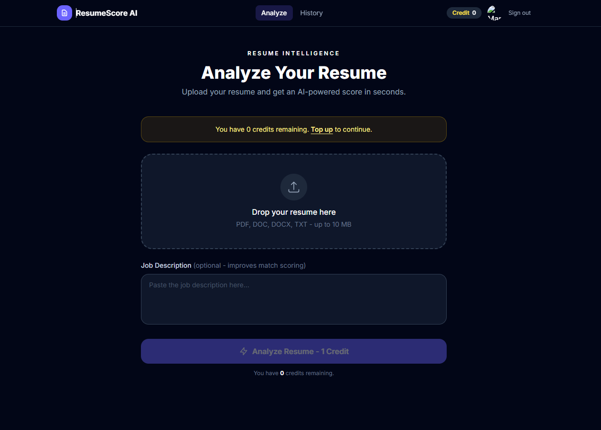
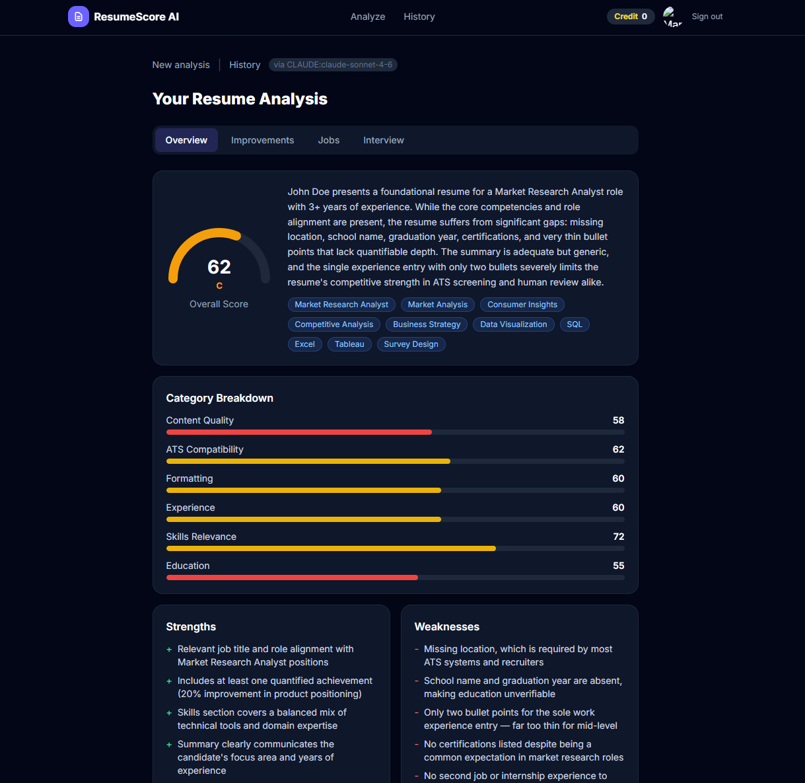
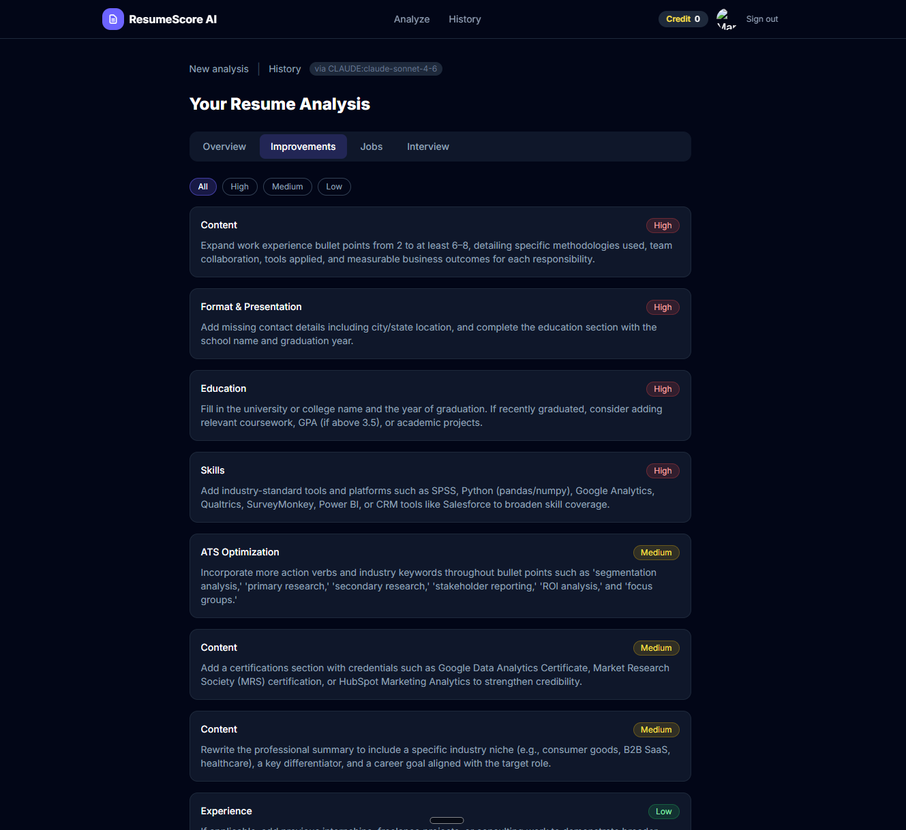
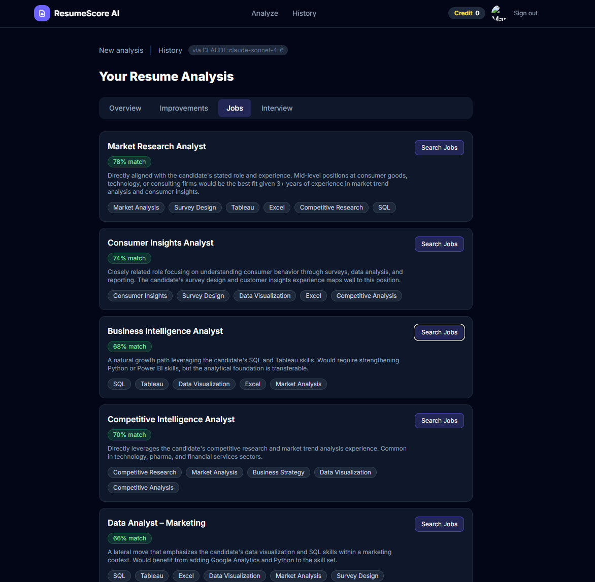
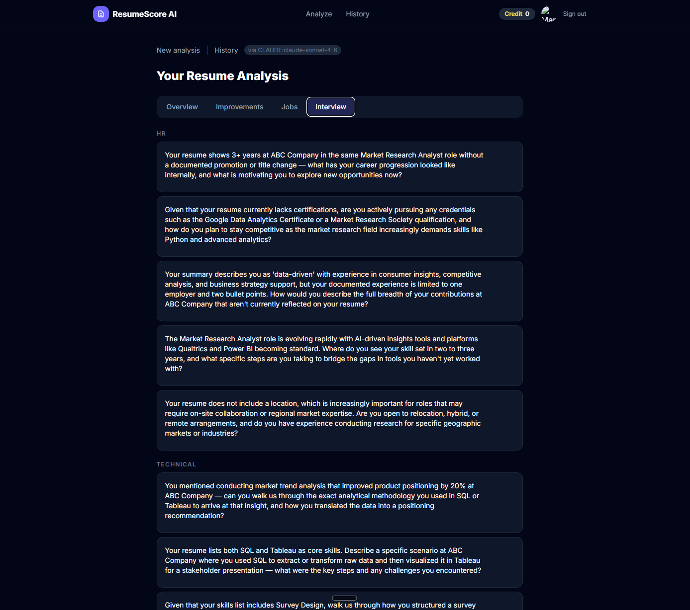
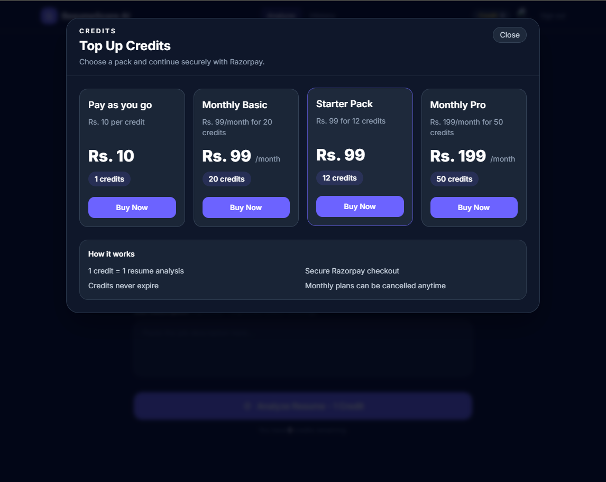
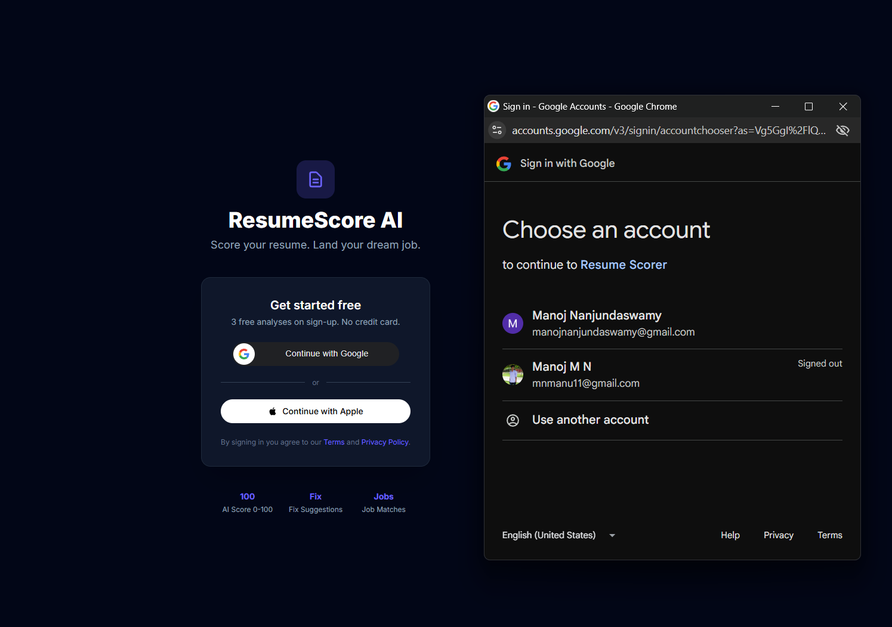
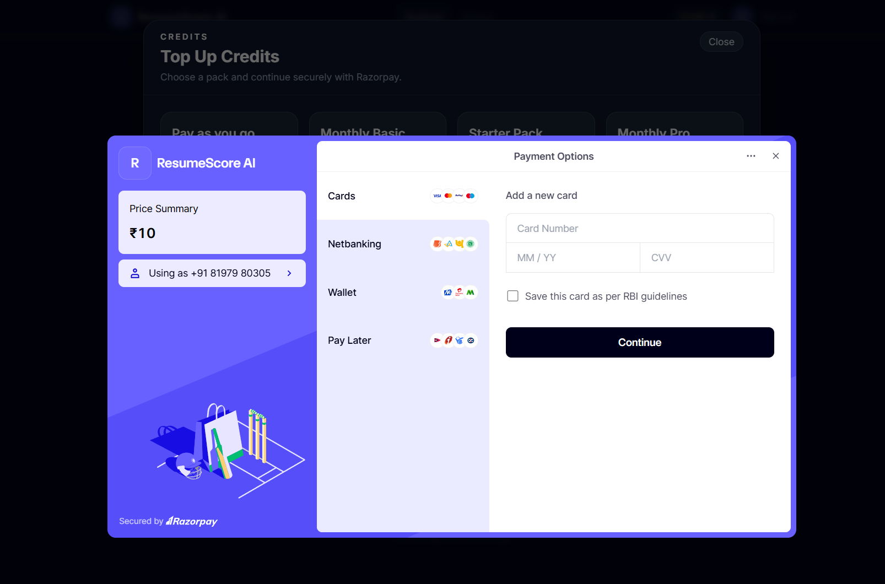

# ResumeScore AI

ResumeScore AI is a full-stack resume analysis app. It lets users sign in, upload a resume, optionally paste a job description, spend credits, and receive an AI-generated resume score with strengths, gaps, keywords, job-fit guidance, and interview preparation help.

This repository contains the current app in these two folders:

- `springboot-backend` - Java 21 / Spring Boot API
- `web-app` - React 18 / Vite browser app

The older `backend` and `frontend` folders are not part of this repo's current application.

## What Is Included

### Backend

- Spring Boot 3.3 REST API on `http://localhost:8080`
- PostgreSQL persistence with Flyway migrations
- JWT-based application sessions
- Google and Apple token verification endpoints
- Resume upload and parsing for PDF, DOC, DOCX, and TXT
- S3-compatible file storage using AWS S3 or local MinIO
- Credit accounting with welcome credits and top-ups
- Razorpay payment order creation and verification
- Pluggable AI providers: `CLAUDE`, `GEMINI`, `OPENAI`, `OPENROUTER`, and `MOCK`
- Health endpoint: `GET /api/health`

### Frontend

- React 18 app served by Vite on `http://localhost:5173`
- Google Sign-In flow
- Protected app routes for upload, analyzing, results, and history
- Resume upload UI with optional job description input
- Credit display and Razorpay top-up modal
- Vite dev proxy from `/api` to `http://localhost:8080`

## UI Showcase

| Analyze flow | Resume score overview |
|---|---|
|  |  |

| Improvement plan | Job recommendations |
|---|---|
|  |  |

| Interview prep | Credits and payments |
|---|---|
|  |  |

Additional screens:  and .

## Quick Start

For the complete Windows local setup, read [LOCAL_SETUP.md](LOCAL_SETUP.md).

Short version:

```powershell
# 1. Configure backend environment
Copy-Item springboot-backend\.env.example springboot-backend\.env
notepad springboot-backend\.env

# 2. Configure frontend environment
Copy-Item web-app\.env.example web-app\.env.local
notepad web-app\.env.local

# 3. Start database/storage and backend
.\start-local.ps1

# 4. In a second terminal, start the web app
cd web-app
npm install
npm run dev
```

Open `http://localhost:5173`.

## Recommended Local AI Mode

For first-time setup, use the mock AI provider so the app can run without an external AI key:

```env
ACTIVE_AI_PROVIDER=MOCK
```

Use a real provider when you want live analysis:

```env
ACTIVE_AI_PROVIDER=CLAUDE
ANTHROPIC_API_KEY=your-anthropic-api-key
```

Supported providers are `MOCK`, `CLAUDE`, `GEMINI`, `OPENAI`, and `OPENROUTER`.

## Services And Ports

| Service | URL | Notes |
|---|---|---|
| React web app | `http://localhost:5173` | Browser UI |
| Spring Boot API | `http://localhost:8080` | REST API |
| API health | `http://localhost:8080/api/health` | Returns `{ "status": "ok" }` |
| PostgreSQL | `localhost:5432` | Docker service |
| MinIO API | `http://localhost:9000` | Local S3-compatible storage |
| MinIO console | `http://localhost:9001` | Login: `minioadmin` / `minioadmin` |

## API Overview

| Method | Path | Auth | Purpose |
|---|---|---|---|
| `GET` | `/api/health` | No | Health check |
| `POST` | `/api/auth/google` | No | Exchange Google ID token for app JWT |
| `POST` | `/api/auth/apple` | No | Exchange Apple identity token for app JWT |
| `GET` | `/api/users/me` | Yes | Current user and credits |
| `POST` | `/api/analyze` | Yes | Upload resume as multipart field `resume`; optional `jobDescription` |
| `GET` | `/api/results/{id}` | Yes | Fetch one analysis result |
| `GET` | `/api/history` | Yes | Fetch analysis history |
| `POST` | `/api/credits/topup` | Yes | Manual/dev credit top-up |
| `GET` | `/api/payment/plans` | No | List Razorpay plans |
| `POST` | `/api/payment/create-order` | Yes | Create Razorpay order |
| `POST` | `/api/payment/verify` | Yes | Verify payment and add credits |

## Project Structure

```text
Resume Scorer/
|-- README.md
|-- LOCAL_SETUP.md
|-- start-local.ps1
|-- springboot-backend/
|   |-- pom.xml
|   |-- docker-compose.yml
|   |-- Dockerfile
|   |-- start-local.ps1
|   |-- src/main/java/com/resumescorer/
|   |   |-- config/
|   |   |-- controller/
|   |   |-- exception/
|   |   |-- model/
|   |   |-- repository/
|   |   |-- security/
|   |   `-- service/
|   `-- src/main/resources/db/migration/
`-- web-app/
    |-- package.json
    |-- vite.config.js
    |-- src/api/
    |-- src/components/
    |-- src/context/
    `-- src/pages/
```

## Verification Commands

```powershell
# Backend compile/package
cd springboot-backend
.\mvnw.cmd -q -DskipTests package

# Frontend production build
cd ..\web-app
npm install
npm run build

# Runtime smoke tests
curl http://localhost:8080/api/health
curl http://localhost:5173/api/health
```

## Secrets

Do not commit these files:

- `springboot-backend/.env`
- `web-app/.env.local`

Commit only the example files:

- `springboot-backend/.env.example`
- `web-app/.env.example`
